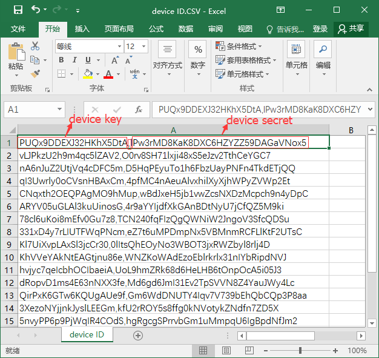
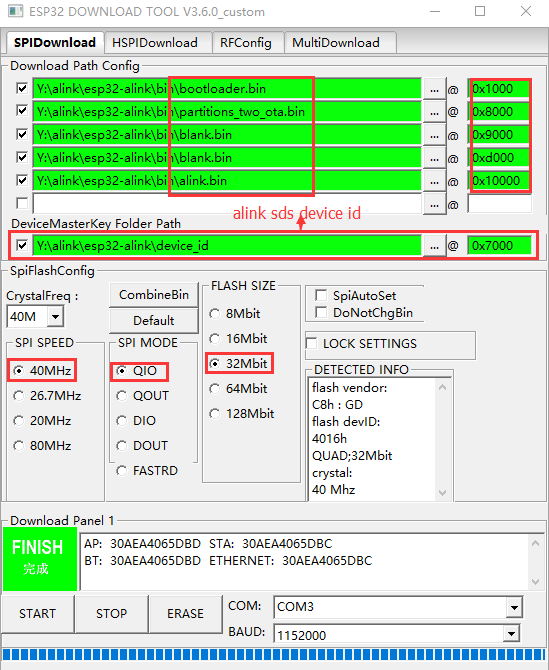
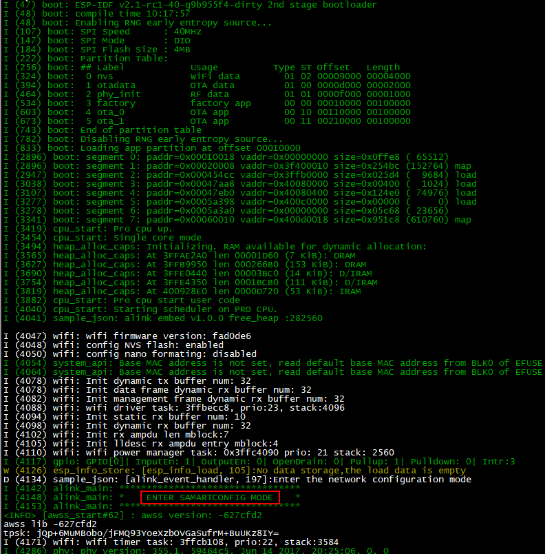

本工程为阿里云 ESP32 ALINK 接口使用示例，你可以通过本示例了解 ALINK 配网、升级及数据传输等

## 1 ALINK 概述
### 1.1 是什么 ALINK
智能硬件模组、阿里智能云、阿里智能 APP，阿里智能生活事业部为厂商提供一站式设备智能化解决方案。alink 到目前已经过了多次的版本迭代，各版本的区别如下：

1. alink v1.0：为阿里提供最基础的版本，支持一键配网，设备热点配网技术，ota 升级等功能
2. alink v1.1：增强设备身份安全
3. alink embed：增加支持零配发现模式，默认配网激活模式，手机热点配网模式，但需要占更多的内存空间
4. alink sds：APP和服务端允许客户定制化，但是需要收取服务收费

> 注：
1. 本工程目前支持的版本的 alink embed 和 alink sds，您可以通过 `make menuconfig` 进行版本切换
2. alink embed 和 alink sds 的版本，目前不支持数据透传


### 1.2 为什么要使用 ALINK
阿里智能开发平台的提供强大的智能平台，极大的简化的智能家居开发的高难度和复杂性，主要有以下六个特点：低成本、短时间、大安全、大数据、标准化和定制化等。


### 1.3 怎么使用 ALINK
我们已经完成 ALINK EMBED SDK 在模组上的适配工作，您在 产品开发时，只需基于模组基础上进行二次开发。


## 2 前置条件
### 2.1 知识储备
1. 了解 ALINK
请详细阅读阿里提供的官方[技术文档](https://open.aliplus.com/docs/open/)，了解 ALINK 相关的概念
2. 熟悉 ESP32 开发
请详细阅读 [ESP32-DevKitC 入门指南](http://www.espressif.com/sites/default/files/documentation/esp32-devkitc_getting_started_guide_cn.pdf) 及 [ESP-IDF 入门指南](http://www.espressif.com/sites/default/files/documentation/esp-idf_getting_started_guide_cn.pdf)

### 2.2 硬件准备
1. 开发板：二块以上 ESP32-DevKitC 开发板（测试零配网功能至少需要两块开发板）
2. 路由器：关闭 5G 网络，且可以连接外网（所有的数据交互必需通过阿里云服务器）
3. 手机：内置有 SIM 卡，可连接 4G 移动网络（测试热点配网功能时，设备需要通过手机热点连接阿里云服务器完成的注册、绑定等过程）

## 3 开发板介绍


| 接口/模块 | 说明 |
| --------   | :-----  |
| ESP-WROOM-32 | ESP-WROOM-32 模组 |
| EN | 复位按键。按下此轻触开关，系统复位 |
|  Boot | 下载键，按下此按键，然后再按下EN按键，系统进入下载模式，通过串口对flash进行下载 |
| USB | USB接口，既为开发板提供电源，以作为通信接口连接 PC 与 ESP-WROOM-32 模组 |
| IO | 扩展了 ESP-WROOM-32 的大部分引脚 |

## 4 文件结构

    esp32-alink-embed-demo
    ├── bin                                     // 存放生成的 bin 文件
    ├── build                                   // 存放所有编译生成的文件
    ├── components
    │   └── esp32-alink_embed                   // ALINK 适配文件
    │       ├── adaptation                      // ALINK 的底层适配
    │       ├── application                     // ALINK 应用层API的封装
    │       │   ├── esp_alink_main.c            // 连接ap、恢复出厂设置、事件回调函数
    │       │   ├── esp_data_transport.c        // ALINK 数据传传输
    │       │   ├── esp_info_store.c            // FLASH 的读写操作
    │       │   └── esp_json_parser.c           // JSON 字符串的生成与解析
    │       ├── component.mk
    │       ├── include
    │       │   ├── alink_export.h              // ALINK 官方提供的原生应用层 API
    │       │   ├── alink_json_parser.h         // ALINK 官方提供的原生JSON API
    │       │   ├── esp_alink.h                 // 封装的应用层API使用说明及配置
    │       │   ├── esp_alink_log.h             // 定义了打印等级
    │       │   ├── esp_info_store.h            // 信息存储API详解
    │       │   └── esp_json_parser.h           // JSON API详解
    │       ├── Kconfig                         // make menuconfig 配置文件
    │       ├── lib                             // 库文件
    │       └── README.md
    ├── device_id                               // 存放 ALINK SDS 的设备 ID
    ├── esp-idf                                 // ESP32 SDK
    ├── gen_misc.sh                             // 编译脚本
    ├── main
    │   ├── alink_key_trigger.c                 // 按键触发函数
    │   ├── component.mk
    │   └── app_main.c                          // ALINK 非透传示例
    ├── Makefile
    ├── README.md
    ├── sdkconfig                               // 保存配置选项
    └── setup_toolchain.sh                      // 编译环境的搭建脚本

## 5 编译环境的搭建

如果您是在 ubuntu x64bit 的平台下开发只需运行脚本 `setup_toolchain.sh`，一键完成开发环境的搭建。若是其他平台请参见：http://esp-idf.readthedocs.io/en/latest/get-started/linux-setup.html

```bash
#!/bin/bash
set -e

# 安装软件
sudo apt-get install git wget make libncurses-dev flex bison gperf python python-serial

# 下载工具链
mkdir -p ~/esp
cd ~/esp
wget https://dl.espressif.com/dl/xtensa-esp32-elf-linux64-1.22.0-61-gab8375a-5.2.0.tar.gz
tar -xzf xtensa-esp32-elf-linux64-1.22.0-61-gab8375a-5.2.0.tar.gz

# 配置环境变量
echo 'export PATH=$PATH:$HOME/esp/xtensa-esp32-elf/bin' >> ~/.profile
source ~/.profile
```

## 6 配置
ESP32 ALINK 的默认配置已经存储在 sdkconfig， 如果你想要详细了解esp32相关配置与编译详见 esp-idf/README.md

### 6.1 ESP-IDF 配置
- 禁用硬件 SHA：Component config->mbedTLS->SHA
- 使能 SO_REUSEADDR：Component config->LWIP->Enable SO_REUSEADDR option
- 配置分区表：Partition Table->Factory app, two OTA definitions

### 6.2 ALINK 配置
使用 `make menuconfig->Component config->Enable alink EMBED function` 配置日志等级，数据传输模式、任务优先级等，推荐使用默认值。
```Makefile
--- Enable alink_embed function
<!-- alink 版本选择 -->
Select the version of alink (esp32 alink sds)  --->
<!-- 上报设备状态是否使用冲缓 -->
[ ]   Remove the buffer space for reporting data
(60)  the connection router maximum latency unit is seconds
(6)   Configure the priority of all alink tasks
<!-- 事件回调函数栈空间 -->
(4096) Event callback function stack space
(4096) The size of the task of reporting data to Ali
<!-- 缓冲队列的深度 -->
(3)   The number of buffered data received
(3)   The number of buffered data send
<!-- 数据包的最大长度。模组认证时需要配置为2k，否则将无法通过超长数据包测试 -->
(2048) The maximum length of the transmitted data
<!-- 修改模组名称，在修改模组名称前，请确认设备已经解绑 -->
(esp32) The name of the chip
(ESP-WROOM-32) The name of the module
<!-- esp8266 适配层日志等级配置 -->
Configure the alink application layer's log (Info)  --->
<!-- alink 官方日志等级配置 -->
Configure the alink sdk's log (Debug)  --->
```

## 7 编译
如果您是在 ubuntu x64bit 的平台下开发只需运行脚本 `gen_misc.sh` 即可完成编译及固件烧录，其他平台的参见：http://esp-idf.readthedocs.io/en/latest/get-started/index.html#setup-toolchain

## 8 固件烧录（windows）
1. 安装[串口驱动](http://www.silabs.com/products/mcu/Pages/USBtoUARTBridgeVCPDrivers.aspx)
2. 安装[烧写工具](http://espressif.com/sites/default/files/tools/flash_download_tools_v3.4.8_0.zip)
3. 烧录相关 bin 文件
    - ESP32_Core_board_V2 支持自动下载，按照如下所示，配置串口号、串口波特率等，按 `START` 即可开始下载程序。如果您使用的是 ALINK SDS 版，需向阿里官方购买设备ID， ALINK SDS 的每一个设备都需要一个唯一的设备ID，并将您购买的设备 ID 导成 csv 的格式放入 device_id 文件夹中。

    
    

    ```
    bootloader.bin------------->0x1000      // 启动程序
    partitions_two_ota.bin----->0x8000      // 分区表
    device_id.bin-------------->0x7000      // alink embed 版本无需烧录设备ID
    blank.bin------------------>0x9000      // nvs flash 数据区
    blank.bin------------------>0xd000      // ota 升级数据
    alink.bin------------------>0x10000     // 主程序
    ```

4. 启动设备
    - 按下此轻触 EN 开关，系统复位，出现“ENTER SAMARTCONFIG MODE”信息，即表示 ALINK 程序正常运行，进入配网模式。
    

## 9 运行与调试
1. 下载APP:
    - ALINK EMBED: [接入阿里智能-厂测包](https://open.aliplus.com/download)
    - ALINK SDS: [独立开发者-DemoAPP](https://open.aliplus.com/download)
2. 登陆淘宝账号
3. 开启配网模组测试列表：
    - 安卓：点击“环境切换”，勾选“开启配网模组测试列表”
    - 苹果：点击“AKDebug”->测试选项，勾选“仅显示模组认证入口”
4. 添加设备：添加设备->“分类查找”中查找对应的类别->模组认证->V3 配网_热点配网(透传模式选择名称带LUA标识的)，详见[《ALINK 配网指南》](docs/config_network_guide.pdf)
5. 按键说明：
    - 激活设备：单击 Boot 按键（<1s）
    - 重新配网：短按 Boot 按键（1~5s）
    - 出厂设置：长按 Boot 按键（>5s）
    - 高频压测：GPIO2 与 3.3v 短接重启

## 10 开发流程
### 10.1 [签约入驻](https://open.aliplus.com/docs/open/open/enter/index.html)
使用淘宝账号签约入驻阿里平台，并完成账号授权
### 10.2 [产品注册](https://open.aliplus.com/docs/open/open/register/index.html)
产品注册是设备上云的必要过程，任何一款产品在上云之前必须完成在平台的注册
### 10.3 [产品开发](https://open.aliplus.com/docs/open/open/develop/index.html)
> 注：除非您有特殊需求，否则您在开发时只需修改 main 下的代码，无需关心其内部实现细节

1. **初始化**


    阿里服务器后台导出设备 TRD 表格,调用`alink_init()`传入产品注册的信息，注册事件回调函数

    ```c
#ifdef CONFIG_ALINK_VERSION_SDS
    const alink_product_t product_info = {
        .name           = "alink_product",
        /*!< Product version number, ota upgrade need to be modified */
        .version        = "1.0.0",
        .model          = "OPENALINK_LIVING_LIGHT_SDS_TEST",
        /*!< The Key-value pair used in the product */
        .key            = "1L6ueddLqnRORAQ2sGOL",
        .secret         = "qfxCLoc1yXEk9aLdx5F74tl1pdxl0W0q7eYOvvuo",
        /*!< The Key-value pair used in the sandbox environment */
        .key_sandbox    = "",
        .secret_sandbox = "",
    };
#else
    const alink_product_t product_info = {
        .name           = "alink_product",
        /*!< Product version number, ota upgrade need to be modified */
        .version        = "1.0.0",
        .model          = "ALINKTEST_LIVING_LIGHT_ALINK_TEST",
        /*!< The Key-value pair used in the product */
        .key            = "5gPFl8G4GyFZ1fPWk20m",
        .secret         = "ngthgTlZ65bX5LpViKIWNsDPhOf2As9ChnoL9gQb",
        /*!< The Key-value pair used in the sandbox environment */
        .key_sandbox    = "dpZZEpm9eBfqzK7yVeLq",
        .secret_sandbox = "THnfRRsU5vu6g6m9X6uFyAjUWflgZ0iyGjdEneKm",
    };
#endif

    ESP_ERROR_CHECK(alink_init(&product_info, alink_event_handler));
    ```

2. **配网**
    - 激活设备：在配网过程中设备需求很服务发送激活指令（具体指令内容由实际产品决定）
    - 主动上报：当设备成功连接到阿里云服务器时需要主动上报设备的状态，以保证云端数据与设备端同步，否则将无法配网成功
    - 事件回调函数：设备配网过程中的所有动作，都会传入事件回调函数中，您可以根据实际需求事件回调函数相应的做相应处理，如在当设备进入配置配网模式灯慢闪，等待激活时灯快闪等

        ```c
        typedef enum {
            ALINK_EVENT_CLOUD_CONNECTED = 0,/*!< ESP32 connected from alink cloude */
            ALINK_EVENT_CLOUD_DISCONNECTED, /*!< ESP32 disconnected from alink cloude */
            ALINK_EVENT_GET_DEVICE_DATA,    /*!< Alink cloud requests data from the device */
            ALINK_EVENT_SET_DEVICE_DATA,    /*!< Alink cloud to send data to the device */
            ALINK_EVENT_POST_CLOUD_DATA,    /*!< The device sends data to alink cloud  */
            ALINK_EVENT_POST_CLOUD_DATA_FAIL, /*!< The device sends data to alink cloud fialed  */
            ALINK_EVENT_STA_GOT_IP,         /*!< ESP32 station got IP from connected AP */
            ALINK_EVENT_STA_DISCONNECTED,   /*!< ESP32 station disconnected from AP */
            ALINK_EVENT_CONFIG_NETWORK,     /*!< The equipment enters the distribution mode */
            ALINK_EVENT_UPDATE_ROUTER,      /*!< Request to configure the router */
            ALINK_EVENT_FACTORY_RESET,      /*!< Request to restore factory settings */
            ALINK_EVENT_ACTIVATE_DEVICE,    /*!< Request activation device */
        } alink_event_t;

        static alink_err_t alink_event_handler(alink_event_t event)
        {
            switch (event) {
            case ALINK_EVENT_CLOUD_CONNECTED:
                ALINK_LOGD("Alink cloud connected!");
                proactive_report_data();
                break;

            .......
            .......
            .......

            case ALINK_EVENT_ACTIVATE_DEVICE:
                ALINK_LOGD("Requests activate device");
                alink_activate_device();
                break;

            default:
                break;
            }
            return ALINK_OK;
        }
        ```
    > 注：
    >    1. 如果您需要传入自己定义的事件，可以通过调用 `alink_event_send()` 发送自定义事件
    >    2. 事件回调函数的栈默认大小为 4k, 请避免在事件回调函数使用较大的栈空间，如需修改请使用 `make menuconfig`


3. **修改触发方式**
    - 您需要根据实际产品，确定以何种方式触发出厂设置、重新配网、激活等操作，本示例使用的是按键触发方式，如果设备没有按键，您可以通过反复开关电源、通过蓝牙等方式触发，具体修改参见 `alink_key_trigger.c`

    ```c
    void alink_key_trigger(void *arg)
    {
        alink_err_t ret = 0;
        alink_key_init(ALINK_RESET_KEY_IO);
        for (;;) {
            ret = alink_key_scan(portMAX_DELAY);
            ALINK_ERROR_CHECK(ret != ALINK_OK, vTaskDelete(NULL), "alink_key_scan ret:%d", ret);

            switch (ret) {
            case ALINK_KEY_SHORT_PRESS:
                alink_event_send(ALINK_EVENT_ACTIVATE_DEVICE);
                break;

            case ALINK_KEY_MEDIUM_PRESS:
                alink_event_send(ALINK_EVENT_UPDATE_ROUTER);
                break;

            case ALINK_KEY_LONG_PRESS:
                alink_event_send(ALINK_EVENT_FACTORY_RESET);
                break;

            default:
                break;
            }
        }

        vTaskDelete(NULL);
    }
    ```

4. **数据通信**
    - 数据格式：确认设备通信时的数据格式（透传/非透传），目前 ALINK EMBED 只支持非透传
        - 透传：设备端收到的二进制格式的数据。由阿里云端服务器的 lua 脚本完成 json 格式与二进制数据的转换
        - 非透传：设备端收到的 JSON 格式的数据，JSON 格式的转换由设备端完成，阿里云端服务器的 lua 脚本是空实现
    - 数据长度：默认长度为1KB，数据长度最大支持2k，如需修改请使用 `make menuconfig`
    - 数据上报：主动上报是由设备端主动发起
    - 数据下发：设备端收的到的数据有设置设备状态和获取设备状态组成

5. **底层开发**
设置 GPIO、UART 等外围设备，参见：http://esp-idf.readthedocs.io/en/latest/api-reference/peripherals/index.html

### 6.4 [发布上架](https://open.aliplus.com/docs/open/open/publish/index.html)
开发调试验证完成后就可以申请发布上架

## 11 注意事项
- 请定期更新本项目工程，后期将有持续对本工程进行优化改进
- 模组不支持 5G 网络，请确认已关闭路由器 5G 网络功能
- 测试热点配网时，请确认 4G 网络处于开启状态
- ALINK 受网络环境影响极大，进行测试时，请保证网络环境良好，否则将无法通过高频压测和稳定性测试。

## 12 Related links
* ESP32概览 : http://www.espressif.com/en/products/hardware/esp32/overview
* ESP32资料 : http://www.espressif.com/en/products/hardware/esp32/resources
* 烧录工具  : http://espressif.com/en/support/download/other-tools
* 串口驱动  : http://www.silabs.com/products/mcu/Pages/USBtoUARTBridgeVCPDrivers.aspx
* 阿里智能开放平台：https://open.aliplus.com/docs/open/
